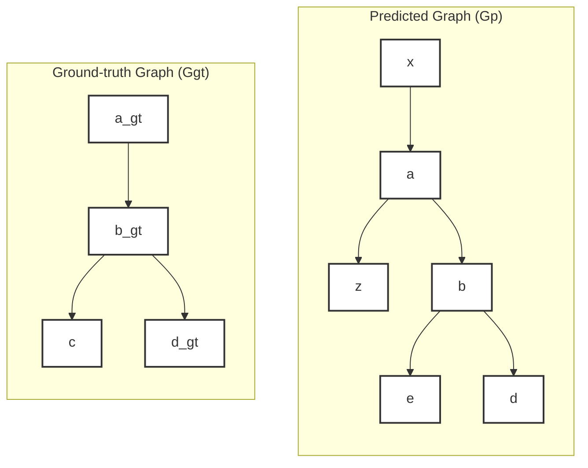

# Evaluation Metrics

## Main Metric Definitions:

- $G_p = (V_p, E_p)$: Predicted graph
- $G_{gt} = (V_{gt}, E_{gt})$: Ground-truth sparse graph
- $L_o$: set of nodes with fully labeled outgoing edges
- $L_i$: set of nodes with fully labeled incoming edges
- $E_{ov} = \{ (s,t) \in E_p \mid (s \in V_{gt} \text{ and } s \in L_o) \text{ or } (t \in V_{gt} \text{ and } t \in L_i) \}$

## Options:

**Jaccard**: $M_j(G_p, G_{gt}) = \frac{|E_{ov} \cap E_{gt}|}{|E_{ov} \cup E_{gt}|}$

## Example:

- $V_p$ = {x, z, a, b, e, d}
- $V_{gt}$ = {a, b, c, d}
- $E_{ov}$ = {(a, z), (a, b), (b, e), (b, d)}
- $E_{gt}$ = {(a, b), (b, c), (b, d)}

Note: (x, a) does not belong to $E_{ov}$ because 'a' is not fully labeled for in-coming edges.

Results:
- $M_j$ = 2 / 5
- $M_d$ = 4 / 7

## Details:

Correspondence between nodes is found using the Hungarian algorithm and a score based on the distance between the centroids up to a threshold.

## Implementation:

Indexing used for implementation testing: https://github.com/royerlab/tracking-challenge/blob/main/scripts/metrics.py
